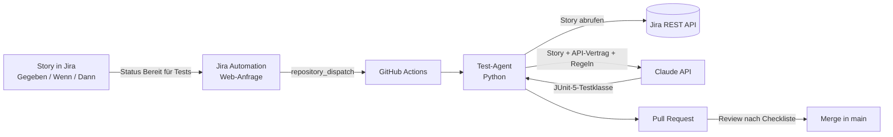

# TaskBoard – KI-gestützte Testautomatisierung

Ein Portfolio-Projekt, das eine durchgängige Kette von der Anforderung bis zum automatisierten Test zeigt: User Stories in Jira werden per Trigger an einen KI-Agenten übergeben, der daraus API-Tests erzeugt und als Pull Request zur Prüfung vorlegt.

Das Testobjekt ist eine kleine Aufgabenverwaltung (TaskBoard). Der Schwerpunkt des Projekts liegt auf der Qualitätssicherung: Shift Left, Contract First und ein nachvollziehbarer Weg von jedem Szenario zu seinem Test.

> **Status: in Arbeit.** Die Kette Jira → KI-Agent → Pull Request läuft vollständig. Das Backend folgt als Nächstes, bis dahin sind die erzeugten Tests aktuell bewusst rot (TDD).

## Ablauf



1. Eine User Story wird in Jira mit Szenarien im Format Gegeben / Wenn / Dann beschrieben.
2. Wird die Story in den Status **Bereit für Tests** verschoben, sendet eine Jira-Automatisierung eine Web-Anfrage an GitHub.
3. Ein GitHub-Actions-Workflow startet den Test-Agenten mit der Story-Nummer.
4. Der Agent holt die Story über die Jira-REST-API, kombiniert sie mit dem API-Vertrag und festen Regeln und lässt daraus eine Testklasse erzeugen.
5. Das Ergebnis landet als Pull Request auf einem eigenen Branch. Kein generierter Test gelangt ohne manuelles Review in `main`.

## Was das Projekt zeigt

- **Shift Left:** Anforderungen und Testfälle entstehen vor dem Code. Grenzwerte, Fehlerfälle und Sicherheitsaspekte werden bereits in der Story festgelegt.
- **Contract First:** Ein gemeinsamer [API-Vertrag](docs/api-vertrag.md) beschreibt Endpunkte, Statuscodes und Meldungen. Tests und Backend richten sich beide danach.
- **Nachverfolgbarkeit:** Jede Testklasse trägt die Story-Nummer als `@Tag`, jeder Test den Szenarionamen als `@DisplayName`.
- **Human in the Loop:** Die KI schlägt Tests vor, die Entscheidung über den Merge bleibt beim Menschen.
- **Least Privilege:** Alle Zugangsdaten liegen verschlüsselt in GitHub Secrets bzw. Jira. Der Token für den Trigger darf nur auf dieses eine Repository zugreifen.

## Grenzen der KI

Die generierten Tests werden vor jedem Merge anhand einer festen Checkliste geprüft:

1. Ist jedes über die API prüfbare Szenario abgedeckt?
2. Werden reine Oberflächen-Schritte erkannt und nur im Kommentar genannt?
3. Stimmen Adressen, Statuscodes und Meldungen exakt mit dem API-Vertrag überein?
4. Werden auch die „Und“-Zeilen geprüft, also dass nach einem Fehler nichts angelegt wurde?
5. Werden die konkreten Beispielwerte aus der Story verwendet?

Im Review gefundene Schwächen fließen als neue Regeln in den Prompt des Agenten ein. Die einzelnen Befunde und Verbesserungen sind in [docs/agent-verbesserungen.md](docs/agent-verbesserungen.md) dokumentiert.

## Stand

| Bereich | Stand |
|---|---|
| Jira-Projekt mit 5 User Stories und 29 Szenarien | ✅ fertig |
| API-Vertrag für alle Stories | ✅ fertig |
| Test-Agent (Python, Jira-API, Claude-API) | ✅ fertig |
| GitHub-Actions-Workflow mit Pull Request | ✅ fertig |
| Trigger aus Jira per Automatisierung | ✅ fertig |
| Generierte API-Tests für TB-1 und TB-3 | ✅ geprüft und gemergt |
| Backend mit Spring Boot | 📋 als Nächstes |
| Frontend mit Angular | 📋 geplant |
| E2E-Tests mit Playwright | 📋 geplant |
| Jenkins-Pipeline mit Rückmeldung der Ergebnisse an Jira | 📋 geplant |

## Tech-Stack

| Bereich | Technologie |
|---|---|
| Anforderungen | Jira Cloud |
| Test-Agent | Python 3.10, Jira-REST-API, Claude-API (Anthropic) |
| Automatisierung | Jira Automation, GitHub Actions |
| API-Tests | Java 17, JUnit 5, REST Assured |
| Backend (als Nächstes) | Spring Boot, PostgreSQL |
| Geplant | Angular, Playwright, Jenkins, Docker |

## Projektstruktur

```
taskboard/
├── .github/workflows/   # GitHub-Actions-Workflow für den Test-Agenten
├── ai/                  # Test-Agent: Story abrufen, Tests erzeugen
├── backend/             # Spring-Boot-Backend (folgt)
├── docs/                # API-Vertrag und Verbesserungen am Agenten
├── e2e-tests/           # Maven-Projekt mit den generierten API-Tests
└── frontend/            # Angular-Frontend (geplant)
```

## Den Agenten lokal ausführen

Voraussetzungen: Python 3.10 oder neuer, ein Jira-API-Token und ein Anthropic-API-Key.

```bash
cd ai
python -m venv .venv
.venv/Scripts/python -m pip install -r requirements.txt   # unter Linux/macOS: .venv/bin/python
cp .env.example .env                                       # Werte in .env eintragen
.venv/Scripts/python generate_tests.py TB-1
```

Die Testklasse wird unter `e2e-tests/src/test/java/de/nidal/taskboard/api/` gespeichert. Ausführen lassen sich die Tests, sobald das Backend unter `http://localhost:8080` läuft.

## Autor

Mohamed Nidhal Ayadi
