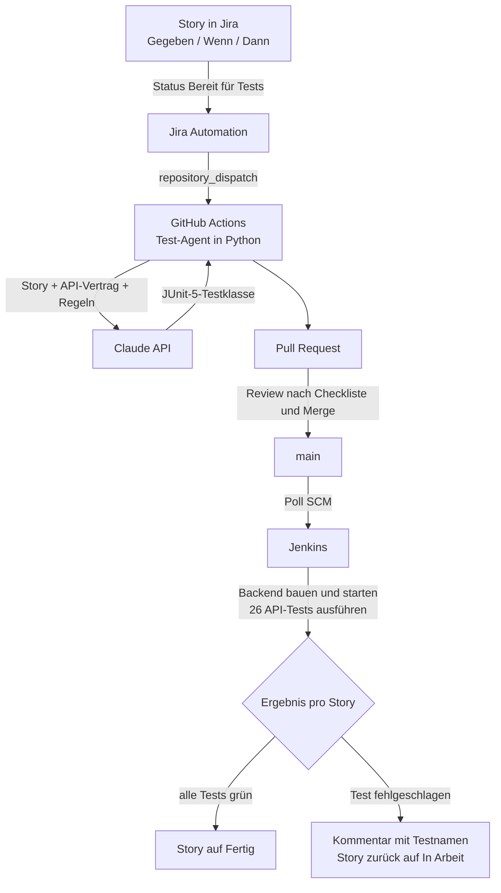

# TaskBoard – KI-gestützte Testautomatisierung

Ein Portfolio-Projekt, das eine geschlossene Kette von der Anforderung bis zum Testergebnis zeigt: User Stories in Jira werden per Trigger an einen KI-Agenten übergeben, der daraus API-Tests erzeugt. Nach dem Review werden die Tests gegen ein Spring-Boot-Backend ausgeführt, und Jenkins meldet das Ergebnis pro Story zurück an Jira.

Das Testobjekt ist eine kleine Aufgabenverwaltung (TaskBoard). Der Schwerpunkt liegt auf der Qualitätssicherung: Shift Left, Contract First, TDD und ein nachvollziehbarer Weg von jedem Szenario zu seinem Test.

> **Stand:** Alle fünf User Stories sind umgesetzt, **26 von 26 API-Tests sind grün**. Die Kette Jira → KI-Agent → Pull Request → Backend → Jenkins → Jira läuft vollständig automatisch. Frontend und E2E-Tests über die Oberfläche folgen.

## Ablauf


```mermaid
flowchart TD
    A[Story in Jira<br/>Gegeben / Wenn / Dann] -->|Status Bereit für Tests| B[Jira Automation]
    B -->|repository_dispatch| C[GitHub Actions<br/>Test-Agent in Python]
    C -->|Story + API-Vertrag + Regeln| D[Claude API]
    D -->|JUnit-5-Testklasse| C
    C --> E[Pull Request]
    E -->|Review nach Checkliste und Merge| F[main]
    F -->|Poll SCM| G[Jenkins]
    G -->|Backend bauen und starten<br/>26 API-Tests ausführen| H{Ergebnis pro Story}
    H -->|alle Tests grün| I[Story auf Fertig]
    H -->|Test fehlgeschlagen| J[Kommentar mit Testnamen<br/>Story zurück auf In Arbeit]
```

1. Eine User Story wird in Jira mit Szenarien im Format Gegeben / Wenn / Dann beschrieben.
2. Wird die Story in den Status **Bereit für Tests** verschoben, startet eine Jira-Automatisierung per Web-Anfrage einen GitHub-Actions-Workflow.
3. Der Test-Agent holt die Story über die Jira-REST-API, kombiniert sie mit dem API-Vertrag und festen Regeln und lässt daraus eine Testklasse erzeugen.
4. Das Ergebnis landet als Pull Request auf einem eigenen Branch. Kein generierter Test gelangt ohne manuelles Review in `main`.
5. Die Tests sind zunächst rot. Das Backend wird so lange weiterentwickelt, bis sie grün sind (TDD).
6. Jenkins baut bei jedem Commit das Backend, startet es mit einer eigenen Test-Datenbank und führt alle API-Tests aus.
7. Ein Skript wertet die Testberichte aus und meldet das Ergebnis an die passende Story: Sind alle Tests grün, wird sie auf **Fertig** gesetzt. Schlägt ein Test fehl, bekommt sie einen Kommentar mit den betroffenen Tests und wandert zurück auf **In Arbeit**.

## Was das Projekt zeigt

- **Shift Left:** Anforderungen, Grenzwerte und Fehlerfälle werden in der Story festgelegt, bevor es Code gibt.
- **Contract First:** Ein gemeinsamer [API-Vertrag](docs/api-vertrag.md) beschreibt Endpunkte, Statuscodes und Meldungen. Tests und Backend richten sich beide danach.
- **TDD:** Die Tests existierten vor dem Backend. Jeder Entwicklungsschritt hat den Grund, warum ein Test rot ist, verändert, bis er grün war.
- **Nachverfolgbarkeit:** Jede Testklasse trägt die Story-Nummer als `@Tag` und im Klassennamen, jeder Test den Szenarionamen als `@DisplayName`. Darüber ordnet Jenkins die Ergebnisse den Stories zu.
- **Human in the Loop:** Die KI schlägt Tests vor, die Entscheidung über den Merge bleibt beim Menschen.
- **Continuous Integration:** Jenkins prüft jeden Commit automatisch, Pipeline as Code im [Jenkinsfile](Jenkinsfile).

## Sicherheit im Backend

- Passwörter werden ausschließlich als **BCrypt-Hash** gespeichert, nachgewiesen per Abfrage direkt in der Datenbank.
- Anmeldung über **JWT mit Spring Security**. Die Nutzer-ID stammt ausschließlich aus dem signierten Token, nie aus der Anfrage.
- Bei falschem Passwort und unbekannter E-Mail antwortet der Login identisch, damit keine registrierten Adressen erraten werden können.
- Jeder Zugriff auf eine Aufgabe prüft den Besitzer. Fremde Aufgaben liefern **404**, damit nicht einmal ihre Existenz verraten wird. Abgedeckt für Lesen, Ändern, Statuswechsel und Löschen.
- Der Endpunkt zum Zurücksetzen der Datenbank existiert **nur im Profil `test`**, im normalen Betrieb liefert er 404.
- Zugangsdaten liegen in GitHub Secrets, Jira und den Jenkins Credentials. Der Token für den Trigger darf nur auf dieses eine Repository zugreifen (Least Privilege).

## Grenzen der KI

Die generierten Tests werden vor jedem Merge anhand einer festen Checkliste geprüft:

1. Ist jedes über die API prüfbare Szenario abgedeckt?
2. Werden reine Oberflächen-Schritte erkannt und nur im Kommentar genannt?
3. Stimmen Adressen, Statuscodes und Meldungen exakt mit dem API-Vertrag überein?
4. Werden auch die „Und“-Zeilen geprüft, also dass nach einem Fehler nichts angelegt wurde?
5. Werden die konkreten Beispielwerte aus der Story verwendet?
6. Kann jede Prüfung überhaupt fehlschlagen, wenn die App sich falsch verhält?

Im Review gefundene Schwächen fließen als neue Regeln in den Prompt des Agenten ein. Zwei Beispiele:

- Ein Test bewies „nach fehlgeschlagenem Login ist niemand angemeldet“ mit einer Anfrage ohne Token. Die hätte immer 401 geliefert, der Test konnte also nie fehlschlagen. Neue Regel: Jede Prüfung muss bei falschem Verhalten scheitern können.
- Ein Sicherheitstest prüfte bei fremden Aufgaben nur zwei von drei ändernden Endpunkten. Neue Regel: Beim Schutz fremder Daten wird jeder Endpunkt aus dem Vertrag getestet.

Alle Befunde und Verbesserungen sind in [docs/agent-verbesserungen.md](docs/agent-verbesserungen.md) dokumentiert.

## Stand

| Bereich | Stand |
|---|---|
| Jira-Projekt mit 5 User Stories und 29 Szenarien | ✅ fertig |
| API-Vertrag für alle Stories | ✅ fertig |
| Test-Agent (Python, Jira-API, Claude-API) mit Trigger aus Jira | ✅ fertig |
| Generierte und geprüfte API-Tests für alle 5 Stories | ✅ 26 Tests |
| Backend mit Spring Boot, alle Stories umgesetzt | ✅ 26 von 26 grün |
| Eigene Test-Datenbank für das Profil `test` | ✅ fertig |
| Jenkins-Pipeline mit Rückmeldung der Ergebnisse an Jira | ✅ fertig |
| Unit- und Integrationstests im Backend | 📋 geplant |
| Frontend mit Angular | 📋 geplant |
| E2E-Tests über die Oberfläche mit Playwright | 📋 geplant |

## Tech-Stack

| Bereich | Technologie |
|---|---|
| Anforderungen | Jira Cloud, Jira Automation |
| Test-Agent | Python 3.10, Jira-REST-API, Claude-API (Anthropic), GitHub Actions |
| Backend | Java 17, Spring Boot 4.1, Spring Security mit JWT, Spring Data JPA, PostgreSQL 16 |
| API-Tests | JUnit 5, REST Assured |
| CI | Jenkins (Pipeline as Code), Docker Compose |
| Geplant | Angular, Playwright, Mockito, Testcontainers |

## Projektstruktur

```
taskboard/
├── .github/workflows/   # Workflows: Tests erzeugen, Jira-Status nach Merge
├── ai/                  # Test-Agent und Rückmeldung an Jira
├── backend/             # Spring-Boot-Backend
├── docker/              # Init-Skript der Test-Datenbank, Jenkins-Image
├── docs/                # API-Vertrag und Verbesserungen am Agenten
├── e2e-tests/           # Maven-Projekt mit den API-Tests
├── frontend/            # Angular-Frontend (geplant)
├── docker-compose.yml   # PostgreSQL und Jenkins
└── Jenkinsfile          # CI-Pipeline
```

## Lokal ausführen

Voraussetzungen: JDK 17, Docker Desktop.

```bash
# Datenbank starten
docker compose up -d

# Backend im Testprofil starten (nutzt die Datenbank taskboard_test)
cd backend
./mvnw spring-boot:run -Dspring-boot.run.profiles=test

# In einem zweiten Terminal: alle API-Tests ausführen
cd backend
./mvnw -f ../e2e-tests/pom.xml test
```

Jenkins lässt sich zusätzlich mit `docker compose --profile ci up -d` starten und ist dann unter `http://localhost:8090` erreichbar.

Für den Test-Agenten werden ein Jira-API-Token und ein Anthropic-API-Key benötigt, siehe `ai/.env.example`.

## Entwicklung mit KI-Unterstützung

Die API-Tests wurden von einem KI-Agenten aus den Jira-Stories erzeugt und vor dem Merge von mir geprüft und verbessert. Das Backend habe ich Schritt für Schritt mit einem KI-Assistenten als Lernbegleiter umgesetzt, jeweils mit Erklärung der Konzepte und Überprüfung durch die Tests. Ziel des Projekts war es, einen realistischen, KI-gestützten QA-Prozess aufzubauen und dabei Spring Boot zu lernen.

## Autor

Mohamed Nidhal Ayadi
